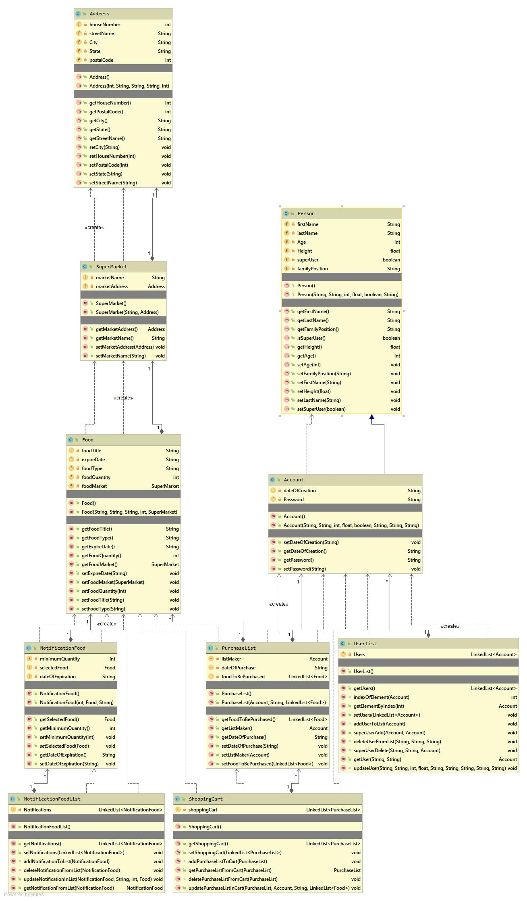

# Fridge-Insight

# Zielbestimmung

Fridge-Insight ist eine Software, mit der Sie Ihren Kühlschrank besser verwalten können. Es enthält viele gut programmierte Funktionen, um ein optimales Verwaltungssystem zu gewährleisten. 

# Muss-Kriterien

## Das System muss die Möglichkeiten bieten: 
### Benutzer zu verwalten. 
 1.Konto addieren 
 2.Konto bearbeiten 
 3.Konto entfernen 

### Benachrichtigungen zu konfigurieren 
 1.Benachrichtigungen erstellen 
 2.Benachrichtigungen bearbeiten 
 3.Benachrichtigungen entfernen 

### Einkauf Liste zu verwalten 
 1.Einkaufskorb erstellen 
 2.Element zum Einkaufskorb hinzufügen 
 3.Element vom Einkaufskorb entfernen 

### Hinzufügen/Entfernen eines Elements 
 1.Produkt addieren 
 2.Produkt bearbeiten 
 3.Produkt entfernen 

# Wunsch-Kriterien

1.Die Menge der Lebensmittel sollte automatisch aktualisiert werden 
2.Die Benachrichtigungen sollen bei Lebensmittelknappheit automatisch erstellt werden 
3.Jeder Benutzer hat die Möglichkeit, ein Profil zu erstellen, in dem er Lieblingsessen und andere Funktionen ablegen kann. 

# Abgrenzungs-Kriterien

1.Nur der "SuperUser" hat die Berechtigung, ein Konto hinzuzufügen, zu ändern oder zu entfernen. 
2.Nur ein "SuperUser" kann ein Produkt hinzufügen, ändern oder löschen. 
3.Nur ein "SuperUser" kann ein anderes Konto als "SuperUser" kennzeichnen. 

# UML Diagram

# UML Diagram mit Test Klassen

